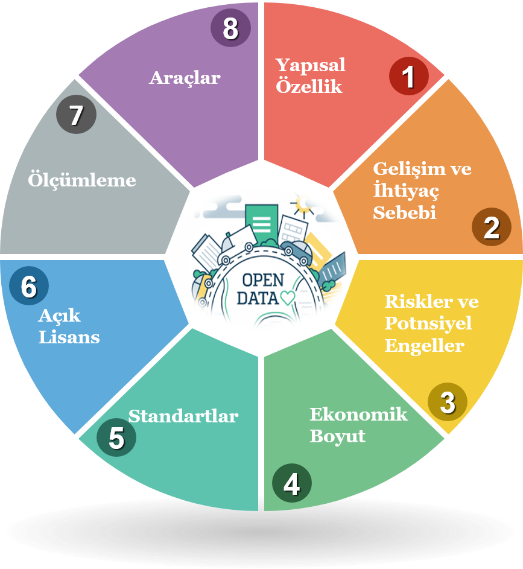

# 2. AÇIK DEVLET VERİSİ

Open Knowledge Foundation kamu verisini, kamuda merkez ve bağlı kuruluşları bünyesinde oluşturulmuş veri olarak tanımlamıştır. Kamu kurum ve kuruluşlarının kanunlarla belirlenmiş temel fonksiyonlarını icra ederken, başlangıçtaki veya sonraki üretme, toplama, işleme, saklama, finanse etme yoluyla edinmiş olduğu bilgi veya bilgiye dayalı ürün/hizmetler kamu sektörü bilgisi olarak adlandırılmaktadır \(CİVELEK & AŞIK, 2011\) .

Açık devlet verisi tekrar kullanılması amacıyla toplanan, saklanan ve dağıtımı yapılan kamu sektörü verileridir veya Parycek, Höchtl, & Ginner \(2014\)’ün belirttiği gibi kamu sektörü verilerinin kullanımı ve dağıtımında hiçbir kısıt olmadan devlet eliyle erişime açılmasıdır.

Açık devlet verisi kavramı kamu verilerinin erişime ve tekrar kullanıma açılmasıdır. Paylaşılması halinde gizliliği, güvenliği, özel hayatı tehlikeye sokabilecek veriler ile kanunen paylaşılmayacağı belirtilmiş veriler ise açık devlet verisi kapsamına dahil değildir. Kamu sektörü verileri belirli bir amaç için toplandıklarından ve belirlenen kullanım amacından daha fazlasını sunma potansiyelinden ötürü açık verinin önemli bir alt kümesidir \(Jetzek, Avital, & Andersen, 2014\).  Nilsen \(2010\) ve Shapiro&Varian \(1999\) açık devlet verisini kaynaklarının 5 karakteristik özelliğini belirtmiştir: 1\) Rakipsiz\(non-rival\) yapıdadır 2\) İnhisariliği yoktur\(non-excludability\) 3\) Sabit maliyeti yüksektir 4\) Marjinal maliyeti neredeyse yoktur 5\) Kıymetli bilgi içerir ve tekrar kullanma olanağı yüksektir.

Tedbirli bir şekilde açık ve makinece okunur formatta ve mümkünse ücretsiz bir şekilde yapılacak yayın kamu sektörü bilgisini açık devlet verisine dönüşümünü sağlar ve telif-patent hakkı gibi yasal ve teknik kısıtlamalar olmaksızın verilerin herhangi bir kişi tarafından tekrar kullanılmasını kolaylaştırır \(OECD, 2016\). Açık devlet verisi girişim süreci iki aktör tipi ile gerçekleşir: sağlayanlar ve kullananlar \(Monino & Sedkaoui, 2016\). Sağlayan-kullanan ekosisteminin aktörleri ise devlet, toplum ve iş dünyası olacaktır. Sağlayan olarak verileri paylaşan devlet ise toplum için sosyal, iş dünyasına yönelik ekonomik ve  kendisi için de iyi yönetişim katma değerlerinin ortaya çıkmasını sağlayacaktır. Kamu verisinin paylaşılması “Açık Devlet” politikasını destekleyecek bir aksiyon olacağından bu aksiyonun kamuda şeffaflığın arttırılması, hesap verilebilirliğin sağlanması gibi olumlu katkıları olacaktır. Özellikle de ekosistemde devlet haricinde kalan ana ve yan aktörlerin devlet yönetimi aktivitelerini takip etmesini ve bir aktör olarak devletin de uyguladığı politikaların etkisini izlemesine olanak sağlayacaktır.

Ubaldi \(2013\) paylaşılması halinde ekonomik ve sosyal değer yaratabilecek veri türlerini ifade etmiştir. Bunlar;

* ticari bilgiler \(ticaret odalarına ait bilgiler, vb.\), 
* evrak, patent ve marka, kamu ihaleleri bilgileri, 
* coğrafik bilgiler \(adres bilgileri, uydu görüntüleri, tapu ve kadastro bilgileri, ulaşım ağları, topoğrafik bilgiler\), 
* hukuki bilgiler \(yerel ve ulusal mahkeme kararları, kanunlar, anlaşmalar\), meteorolojik bilgiler \(iklim bilgileri ve modelleri, hava tahminleri\), 
* sosyal veri \(ekonomik, işsizlik, sağlık, toplumsal ve kamu yönetimi verileri\),
* ulaşım bilgileri \(trafik yoğunluk, yol çalışma, toplu taşıma, araç kayıt, vb. veriler\).

Kamu sektörü verilerini açık hale getirilmesiyle tek başına bir kazanım sağlanması beklenilemez. Son kullanıcı olan vatandaş için ham veri değil bu ham veri ile oluşturulacak yeni servis daha önemlidir. Bu yüzden ham verilerin paylaşılmasıyla ilgili servislerin oluşturulmasını sağlayacak birey, özel kurum, gönüllü organizasyonlar arasında bir ağ kurulması büyük önem arz etmektedir. Heimstädt’a göre dijital bir ekosistem 4 özelliği içerir: \(1\) konjonktürellik\(cyclical\), \(2\) sürdürülebilirlik \(sustainable\), \(3\) \(aktörler arası\) talebe dayalı ilişki \(demand-driven environments\), \(4\) değer transferinde aktörler arası karşı bağımlılık \(mutually interdependent\)\(Heimstädt, Saunderson, & Heath, 2014\). Bu kapsamda açık devlet ekosistemi analiz edilirken aktörlerin ve aktörler arasındaki ilişkinin belirtilmesi de gereklidir. Şekil 1.2’de de görüleceği üzere Deloitte raporuna göre başarılı bir açık devlet ekosisteminde 3 anahtar paydaş söz konusudur: devlet, özel sektör ve vatandaş \(Deloitte, 2012\). Devlet bu ekosisteme “üretilen, toplanan veya vatandaşın vergisiyle satın alınan ve hassas olmayan” veriyle katkıda bulunurken, özel sektör de kurum-içi üretilen verilerini belli kısıtlamalar ile paylaşır. Vatandaş işe kişisel ya da kişisel olmayan verileriyle bu ekosistemde yer alır. Kamu sektörü verisinin açılmasının amacı dijital dünyaya adapte olabilmek ve ulusal açık veri ekosistemine katkıda bulunmaktır \(OECD, 2016\).

 

Açık devlet verisi ekosistemindeki paydaşları sınıflandırmak için farklı birçok kriter önerilmiştir \(Tennert & Schroeder 1999, Blair & Whitehead 1988, Clarkson 1995, Mitchell, Agle, & Wood 1997\). Bu çalışmalar kapsamında Open Data Monitor paydaşları açık veri çalışmalarını olumlu ya da olumsuz etkileyebilecek güce sahip paydaşları sınıflandırmıştır. \(Open Data Monitor, 2017\).

🔰 **Açık veri sağlayıcıları:** Açık veri sağlama gücüne sahip paydaşlardır.

🔰**Destek birimleri:** Stratejik yönlendirme, hukuki danışmanlık, vb. hizmetler sağlayan aracı paydaşlardır.     

🔰**Açık veri kullanıcıları:** Veriyi analiz etmek için belirli araçları kullanan kişi veya kurumlardır.

🔰 **Politika yapıcılar:** Politika yapıcılar ekosistemde direkt olarak dahil olmasalar da kamu sektöründe açık veriye yönelik gerçekleşecek inovatif süreçlerde önemli bir role sahiptirler.

🔰**Savunucu gruplar:** Açık veri süreçlerinin yaygınlaşmasını hedeflerler.

Ayrıca Almazan & Garci \(2014\)’e göre kamu verilerini vatandaşla paylaşıldığı bir platform da gereklidir. Açık veri ekosistemini oluşturmak için birçok paydaşı bir araya getirmek ve sürdürülebilirliği sağlamak orta ve uzun vadede ele alınması gereken bir süreçtir. Heimstädt, Saunderson, & Heath \(2014\) Birleşik Krallık’taki açık veri ekosistemine yönelik zaman çizelgesi analizi gerçekleştirmiş ve dijital bir ekosistemin belirli paydaşları tanımlamıştır. Bunlar: **veri sağlayan bağımsız aktörler**, **aracılar** ve **tüketicilerdir**.

Birçok kaynakta farklı tanımlarla ifade edilen açık devlet verisi  yapısal özellik, gelişim ve ihtiyaç sebebi, riskler ve potansiyel engeller, ekonomik boyut, standartlar, açık lisans, ölçümleme, araçlar başlıklarını içeren bir çerçeve üzerinde ele alınmasınında fayda görülmüştür.

