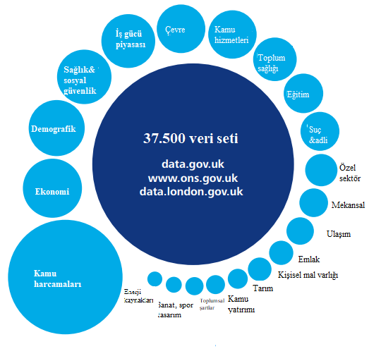

# 3.2.3. Birleşik Krallık

Birleşik Krallık’ta 1990 sonlarından itibaren sivil kuruluşların faaliyetleri sonucu kamu sektörü bilgilerini paylaşmasına yönelik süreçler başlatılmıştır. Açık veri ekosisteminin oluşturulmasına yönelik ilk girişim ise 1998’te Başbakanlık Ofisi’nin “Bilgi Çağında Kraliyet Telif Hakları” adlı bildiriyi yatılmasıyla başlamıştır. 2000 yılında Kamu Sektörü Bilgisi Ofisi tarafından “Tıkla-Kullan” başlıklı lisanslama şemasının yayınlanmasıyla kraliyet telif hakları altındaki verilerin ticari ya da ticari olmayan kullanımına izin verilmiştir \(Heimstädt, Saunderson, & Heath\).

Kasım 2003’te Avrupa Birliği tüm üye ülkelerin kamu kurumlarında ortak bir yasal çerçeve oluşturulması amacıyla “Kamu Sektörü Bilgisinin Tekrar Kullanımı Direktifi”ni yayınladı. 2005 yılında “Bilgiye Erişim Özgürlüğü Yasası” ile birlikte ülkede çeşitli sivil toplum kuruluşların çalışmaları da arttı. Ekim 2005’te Open Knowledge Foundation, daha sonra “Open Knowledge Conference\(OKCon\)” adı altında yıllık olarak düzenlenmiş olan, “World Summit on FreeInformation Infrastructure” etkinliğini düzenledi. Bu etkinliğin hemen ardından OKF kendi açık bilgi tanımını açıkladı.

Mart 2006’da Guardian gazetesinin “Free Our Data” kampanyasıyla eş zamanlı olarak Bakanlar Kurulu Genel Sekreterliği kamu sektörü verilerinin açılmasına yönelik çalışmalarını yoğunlaştırdı. Çalışmaların sonunda Haziran 2007’de vatandaş ve devlet bilgilerinin kullanımına yönelik pratik bakış sunan “Power of Information Review” dokümanı yayınlandı \(Mayo & Steinberg, 2007\). Steinberg ve Mayo’nun tavsiyeleri dahilinde Mart 2008’te Birleşik Krallık hükümeti “Power of Information” görev gücü oluşturdu. İlgili görev gücü iş dünyası, sivil toplum kuruluşlarından ve kamu kuruluşları temsilcilerinden oluşmaktaydı. İlgili görev gücü kuruluşundan üç ay sonra Bakanlar Kurulu Genel Sekreterliği ile birlikte “Show Us A Better Way” yarışmasını duyurdu. Herkese açık olan bu yarışmada dijital uygulamalar oluşturabilmeleri için geliştiricilere daha önce erişime kapalı olan\(Devlet Sağlık Hizmetleri veri tabanında yer alan tedavi verileri, London Gazette’deki resmi bildiriler, İngiltere ve Galler’deki tüm okulların listesi, vb.\) kamu sektörü verileri paylaşıldı. “Where Does My Money Go?”, “OKF-runOpenSpending” gibi önemli açık veri uygulamaları bu yarışmaların kazananları arasında yer almıştır.

“Power of Information” çalışma grubunun Şubat 2009’da çalışmalarına yönelik nihai raporu paylaşmasının ardından Bakanlar Kurulu Genel Sekreterliği eylemleştirme adımlarına başladı. İlgili raporda yer alan önerilerden birisi de kamu verilerine tek bir noktadan erişimin sağlanacağı bir portalın gerçekleştirilmesiydi. Bu kapsamda Eylül 2009’da Birleşik Krallık’ın Açık Veri portalı data.gov.uk için geliştirme çalışmalarına başlandı. Berners-Lee ve Nigel Shadbolt’un da yer aldığı çalışmalar neticesinde Ocak 2010’da data.gov.uk herkesin erişimine açıldı \(Heimstädt, Saunderson, & Heath\).

ABD ve Brezilya önderliğinde kurulan AYO’nun kurucu üyelerinden biri de Birleşik Krallık’tır. Birleşik Krallık ilk AYO Ulusal Eylem Planını 2011 yılından yayınlamıştır. Birleşik Krallık devleti Eylül 2012’den Kasım 2013’e kadar AYO eş başkanlığını yürütmüştür, Temmuz 2014’te Yürütme Komitesinde yer almıştır, Eylül 2016’dan itibaren de İşbirlikçi Öğrenim ve Destek Alt Komitesi eş başkanlığında yer almıştır. Birleşik Krallık’ın Ulusal Eylem Planlarında dört öncelik alanda taahhütte bulunmuştur: mali şeffaflık, yolsuzlukla mücadele, devlet yönetiminde şeffaflık, ulusal veri altyapısına yatırım \(OGP, 2018\).

Data.gov.uk Birleşik Krallık’taki çeşitli kamu kuruluşlarından yaklaşık 30 bin veri setini içermektedir \(Cabinet Office, 2010\). Portalın geliştirilme sürecinde farklı teknolojik ortaklar yer almıştır. Bunlardan biri de birçok devletin açık veri portalı teknolojik altyapısı için tercih ettiği CKAN geliştirme ekibidir. CKAN, Open Knowledge Foundation tarafından geliştirilmiş bir yazılım olup data.gov.uk portalı için bu yazılım tercih edilmiştir. İlgili yazılım olanakları doğrultusunda data.gov.uk portalı ara yüz ve web servis hizmeti sunmaktadır \([https://data.gov.uk/about](https://data.gov.uk/about), 2018\).

OKF tarafından geliştirilen [**Where Does My Money Go?**](https://app.wheredoesmymoneygo.org/)  web sitesiyle vatandaşlar Birleşik Krallık devletinin vergileri nasıl harcadığını görüntüleyebilir ve analiz yapabilmektedir. Kullanıcılar ulusal ve bölgesel düzeyde sağlık, savunma, eğitim, emniyet güçleri, çevre düzenlemeleri ve yönetimsel harcamaları takip edebilmektedir. Sunulan analiz sonuçları için Hazine’nin her yıl yayınladığı bölgesel analiz verileri kullanılmaktadır \(Bureau of Communications Research, 2016\).

Açık verinin ekonomik katkısını arttırmak hem çeşitli politika dokümanlarına hem de akademik çalışmalara göre Birleşik Krallık hükümetinin öncelikleri arasında yer almaktadır \(Bureau of Communications Research, 2016\). Özel Sektör İş Geliştirme ve Yetenek Departmanı tarafından yayınlanan kamu sektörü bilgisine yönelik market araştırması raporuna göre açık verinin ekonomik katkısı 3.7 milyar dolar civarındadır. Sosyal değere etkisi de dahil edildiğinde bu değer 14 milyar doları bulmaktadır \(Department for Business, 2013\). Birleşik Krallık’a ait kamu verisinin açılmasının ekonomik katkıya etkisine yönelik birçok akademik çalışma mevcuttur. Pollock \(2009\)’ın tahminlerine göre açık devlet verinin ekonomik katkıya miktarı yıllık 3.3 milyar dolar ile 4.2 milyar dolar arasını bulabilir. Carpenter & Watts \(2013\)’ın çalışması ise sektör spesifik ekonomik etkiye dair çalışmalar için iyi bir örnektir. İlgili çalışmada Britanya merkezli haritalama çalışmaları yapan bir kuruluş olan Ordnance Survey’in GSYH’ye 59.3 milyon dolara kadar bir katkı sağlayabileceği belirtilmiştir.

