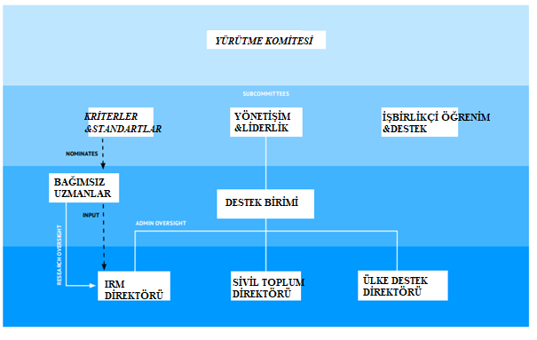
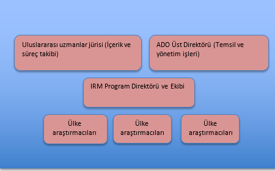

# 3.1.1. Açık Yönetim Ortaklığı

Demokratik devletler her ne kadar demokratikliğin gerekliliği olmasına karşın şeffaflık konusunda vatandaşlarının beklentilerini karşılamakta bazen yeterli olmayabilmektedir \(Birkinshaw, 2006\). Dünyada popüler bir söylem haline gelen “açık devlet” kavramı ile kamu kurumlarında oluşturulan eylem, hizmet ve çıktıların herkese erişme açılması ve vatandaş tarafından görülebilir olması gibi aksiyonlar demokrasinin görünürlüğü olarak kabul edilebilir\(Harrison & Sayogo, 2014\). Bu kapsamda birçok devlet Açık Yönetim Ortaklığı’na katılmıştır. \(Open Government Partnership\). Açık Yönetim Ortaklığı bu çalışmanın sonraki kısımlarında AYO olarak ifade edilecektir.

AYO devlet yönetimlerinin şeffaflığı, hesap verilebilirliği ve katılımcılığı güçlendirmeye odaklanarak hizmet ve refah seviyesini artırmayı amaçlayan çok paydaşlı bir oluşumdur. AYO açık devlet politikasının güvenilir ve başarılı bir yönetim için  etkili bir enstrüman olduğunu savunan devletleri ve önde gelen sivil toplum kuruluşlarını bir araya getiren bir oluşumdur. AYO’nun kuruluşundan bu yana   2017 yılı itibariyle 66 ülkeye ulaşmıştır. Ayrıca AYO sürecine çeşitli ülkelerden yüzden fazla STK de yer almaktadır. AYO ülkeleri dünya nüfusunun üçte birini temsil etmekte olup bu ülkelere ait toplamda 2000’den fazla açık devlet reform taahhüdü yayınlanmıştır.\(OGP, 2015\).

ABD’de Ocak 2009’da Şeffaflık ve Açık Devlet Bildirisi, Aralık 2009’da ise Açık Devlet Direktifi’nin yayınlanmasının ardından Obama Birleşmiş Milletler Genel Kurulu’nda ABD’nin yolsuzlukla mücadele, şeffaflığın sağlanması ve katılımcılığın güçlendirilmesini sağlamak amacıyla ulusal açık devlet girişimini tanıtarak tüm ülkelere benzer uygulamaların sağlanmasına yönelik çağrıda bulunmuştur \(Weinstein, 2013\). Uluslararası bu çağrının ardından 2011 yılında sekiz ülke \(Brezilya, Endonezya, Filipinler, Meksika, Norveç, Güney Afrika, Birleşik Krallık, ABD\) ve açık devlet konusunda faaliyetlerde bulunmuş dokuz STK, New York’taki Birleşmiş Milletler Genel Kurulu’nda bir araya gelerek Açık Yönetim Platformu’nu kurmuşlardır \(Weinstein, 2013\).

AYO, STK ve devlet yönetimlerinin bir araya getirip AYO prensiplerinin geliştirilmesi üzerine ortak çalışma fırsatı vererek açık devletin gerekliliğini ve STK’lerin bu süreçteki öneminin görülmesi olanağını katılımcı ülkelere sağlamaktadır \(Vasani, 2013\).

Ülke seviyesinde  AYO’nun ulusal politika mekanizması olan “Ulusal Eylem Planı \(National Action Plan\)” süreci açık devlet için \(politika\) tasarlama, uygulama ve izleme taahhütlerinde bulunmaları üzerine işbirlikçi davranmaları adına ülkeleri ve STK’leri destekler. Küresel düzeyde ise AYO uluslararası bir ağ olanağı sağlar ve  daha radikal reformlar için ülkeleri bir rekabet içine girmelerini teşvik etmeyi hedefler. Tüm bu hedeflerin sonucunda AYO farklı seviyedeki birçok paydaşı bir araya getirerek açık devlet sürecinin ilerlemesi için birlikte çalışmalarını sağlamayı amaçlamaktadır\(Global Integrity, 2016\).

##  **Yönetim Yapısı**

### **AYO Yürütme Komitesi \(OGP Steering Committee\)**

Yürütme Komitesi ortaklığın ana stratejilerine yön verir. Ayrıca Destek Birimi’ni izler. Ortaklıkta yer alan ülkelerden ve STK’lerden on birer üyesiyle birlikte 22 üyeden oluşur. Yeni üyelerin de yürütmede yer alması için senede bir defa görev devri gerçekleşir. 4 eş başkanın yer aldığı bu yapıda bölge, cinsiyet ve sektör alanları konusunda dengeli davranılır \(OGP Brochure, 2016\).

Yürütme Komitesi, ortaklığın en üst düzey karar mekanizması olmakla beraber iki rolü birden üstlenir. Komite bir devlet organı gibi politika belgeleri, programlar ve usuller belirlediği gibi komitede yer alan ülkeler AYO’nun etkinliğini arttırmak  ve diğer ülkelere örnek olmak için diplomatik kanalları sonuna kadar kullanır \(OGP, 2014\). Yürütme Komitesi’nin birincil sorumlulukları;

🔷Üst düzey strateji, politika ve prosedürler belirlemek,

🔷Ülkeleri AYO taahhütlerini yerine getirmesi için desteklemek,

🔷Kaynak yaratarak destekler sağlamak,

🔷Uluslararası arenada AYO’yu temsil etmek ve ortaklığın başarılarını sunmak,

🔷AYO değer ve prensiplerine bağlı kalmak ve değer sağlayacak taahhütlerde bulunmak,

🔷Yeni Yürütme Komitesi’ni belirlemek ve oryantasyonu sağlamak,

🔷Önemli potansiyel ortaklarla AYO ile bir araya getirmek,

🔷Destek Birimi’nin yıllık bütçesini ve iş planını onaylamak.

### **Alt komiteler**

Yürütme Komitesi çalışmalarını desteklemesi amacıyla üç alt komite içerir: **Yönetişim ve Liderlik**, **Kriter ve Standartlar**, **İşbirlikçi Öğrenim ve Destek**. Alt komiteler Yürütme Komite toplantıları dışındaki sürelerde bir araya gelerek bilgilendirme toplantıları gerçekleştirirler. Her bir komitede  devlet ve STK’lerden eşit sayıda asil ve yedek üye yer alır.

**Yönetişim ve Liderlik Alt Komitesi:** AYO’nun genel stratejilerini hazırlayan ve Destek Birimi’ni denetleyen yetkili alt komitedir.

**Kriter ve Standartlar Alt Komitesi:** AYO yeterlilik kriterleri, üzerine tanım ve yol haritasını hazırlar, gereklilikleri raporlar ve Bağımsız Raporlama Mekanizması\(IRM\) üzerine tavsiyede bulunur \(Negatif bir IRM’nin yaratacağı senaryonun belirlenmesi, vb.\).

**İşbirlikçi Öğrenim ve Destek Alt Komitesi:** AYO’nun stratejisini katılımcı ülkelerin işbirliği üzerine inceler ve AYO’nun etkilerini ülkesel ve küresel bazda inceleyip dokümante eder.

### **Destek Birimi**

Destek birimi katılımcı ülkelerin tümü için sekretarya hizmetlerini yürütür, kurumsal iletişimi sağlar, AYO’nun kurumsal ortakları ve destekçileri ile iletişimin devamı üzerine faaliyetlerini sürdürür.

## **AYO’ya Katılım**

AYO dokümanında \(OGP, 2015\) ilgili platforma katılım 4 aktör üzerinden ele alınmıştır: **Devletler**, **STK’lar**, **özel sektör** ve **gözlemciler**.

### **Devletler**

AYO’ya dâhil olmak isteyen ülkelerin öncelikle açık yönetimle ilgili asgari yeterlilikleri karşılamaları ve Açık Yönetim Ortaklığı Bildirisi’ni kabul etmeleri gerekmektedir. Ortaklık için ilk adım olan asgari yeterliliklerin karşılanması ile kastedilen, hükümetlerin dört temel alanda \(Mali Şeffaflık, Bilgi Edinme Hakkı, Gelir ve Mal Bildirimi, Vatandaş Katılımı\) belirlenmiş olan kriterlere uyum sağlamalarıdır\(AK, 2011\). Bu 4 kriteri sağlayan devletler AYO katılım sürecinde 3 aşamayı yerine getiriler: 

1. İlgilisi AYO Yürütme Komitesi Eş Başkanları olacak şekilde AYO’ya katılım niyetinin taşıyan bir mektup gönderilir. Bu mektup üst seviye bir politik lider tarafından \(en az Bakan düzeyinde\) imzalanmış olmalı ve ekinde Açık Devlet Beyanında yer alan prensiplerin kabulünün taahhüt edildiği doküman da yer almalıdır. 
2. Sorumlu bir Bakanlık belirlenmeli ve AYO standartlarına uygun bir Ulusal Eylem Planı geliştirme hazırlıklarına başlanmalıdır 
3. Eylem planı sonrasındaki süreç AYO’nun IRM sürecine uygun gerçekleştirilmelidir\(OGP, 2015\).

İlgili süreç sonucunda AYO katılım sürecindeki devletlerin 5 adımı yerine getirmiş olmasını talep etmektedir: 

1. Üst düzey seviyeden çıkacak şekilde Açık Devlet Bildirisini yayınlamak, 
2. Ulusal Eylem Planında yer alacak, ilgili ülkenin mevcut durumundan daha ileriye götürecek önemli taahhütlerde bulunmak, 
3. Ulusal eylem planlarını vatandaş ve STK’lerin aktif katılımına yönelik hazırlamak, 
4. Ulusal eylemlerin ölçümlerine yönelik öz değerlendirme ve bağımsız raporlandırma süreçlerinin uygulanmasını taahhüt etmek, 
5. İyi örnekleri, deneyimleri paylaşarak ve teknik, teknolojik yardımlarda bulunarak diğer ülkelere katkı sağlamak.

Ulusal eylem planları iki yıllık süreci kapsamaktadır. Ancak ülkelerin taahhüdüne göre bu süre daha kısa veya uzun olabilir. Eylem planlarında bir ve iki yıllık ölçümlendirmeye yer verilmesi şart koşulmuştur. Eylem planlarının uygulanması ile ilgili olarak ülkelerin performansını ortaya koyan iki ayrı mekanizma bulunmaktadır. **Birincisi**, hükümetlerin yıllık olarak ilgili yılın bitiminden itibaren iki aylık süre içinde hazırladıkları _öz değerlendirme_ raporlarıdır. **İkincisi** ise AYO IRM biriminin eylem planlarının geliştirilmesi ve uygulanması ile ilgili olarak yılda iki defa yaptığı raporlamalardır \(AK, 2011\). 

Öz değerlendirme raporunun süresi “yıllık olarak ilgili yılın bitiminden itibaren” üç ay olarak güncellenmiştir. Ayrıca öz değerlendirme raporu İngilizce ve ilgili ülkenin resmi diliyle olacak şekilde herkesle paylaşılmalıdır. Bunun yanında; ikinci öz değerlendirme raporu iki yıllık sürenin sonunda da AYO tarafından talep edilmektedir. 

IRM raporlamalarında, ilgili ülkeye bir sonraki eylem planlarıyla ilgili teknik öneriler de sunulmaktadır. IRM raporları tüm paydaşların gelişmeleri ve sonuçları takip edeceği yegane araç olduğu için hükümetlerin IRM raporlama süreçlerine aktif olarak katılmaları ve \(AYO\) yerel denetçilere gerekli veriyi sağlayarak yardımcı olmaları gerekmektedir \(AK, 2011\).

Açık Yönetim Ortaklığı tarafından diğer ülkelerin ilham alması için 35 ülkenin öne çıkan eylemleri incelenmiş ve bir rapor oluşturulmuştur. Bu rapora göre ülkelerin taahhütleri şu 7 maddede yoğunlaşmaktadır \(AK, 2011\):

1. Vatandaşların politika yapım sürecine dâhil olmaları,
2. Yolsuzlukla mücadele ve demokratik kurumların güçlendirilmesi,
3.  Bilgi edinme hakkının yasal olarak tanınması,
4.  Mali şeffaflık; vatandaşların vergilerin nereye gittiğini takip edebilmeleri,
5. Kamu hizmet sunumunun vatandaşların ihtiyaçları doğrultusunda yapılması,
6. Ekstraktif gelirlerin \(değerli madenler, petrol, doğalgaz gibi\) kamu yararına kullanılmasının temin edilmesi,
7. Açık veri; verilerin elektronik ortama aktarılması ve erişime açılması.

### **Sivil Toplum**

Ülkelerin yanında STK’ler de alt komitelerde yer alabilir, ulusal eylem planlarının geliştirilmesi, uygulanması, izlenmesi süreçlerinde yer alabilir ve diğer AYO etkinliklerine katılabilirler.

### **Özel Sektör**

AYO tatbik edilme aşamasında özel sektörün de ulusal eylem planlarının geliştirilmesi, uygulanması, izlenmesi süreçlerine katılımını teşvik ettiğini dokümanlarında ifade etmiştir. Ayrıca altı ayda bir gerçekleşen toplantılarına ve diğer etkinliklerine özel sektör de isteğe bağlı katılabilmektedir.

### **AYO Gözlemcileri**

Çeşitli uluslararası organizasyonlar ve hükümetler arası kuruluşlar Yürütme Komitesi’nin davetiyle AYO altı aylık toplantısına ve Yürütme Komitesi’nin yer aldığı çalışmalara gözlemci olarak katılabilirler. Gözlemciler ilgili toplantılarda oy kullanamaz ancak görüşlerini ifade edebilirler.

