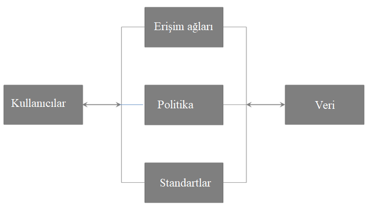
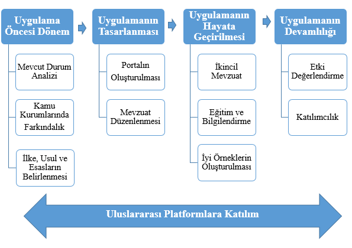
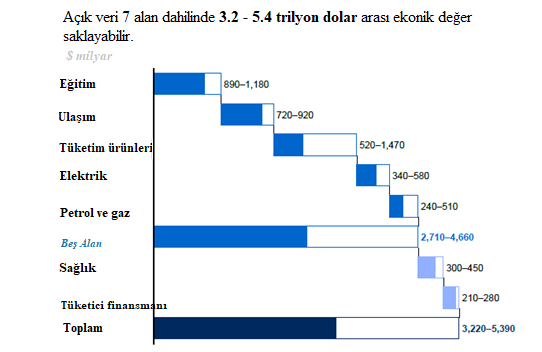

# 5. KAMU VERİSİNİ AÇARKEN

Çalışma kapsamında diğer ülkelerin açık devlet verisi uygulamaları ve politika dokümanları ile uluslararası sivil toplum kuruluşlarının çalışmaları incelenmiş ve edinilen bulgular sonucunda bir model oluşturulmuştur. Modelin oluşturulmasında “Dünyada Açık Devlet Verisine Yönelik Örnekler” başlığı altında paylaşılan deneyimlerden ve modellerden de yararlanılmış ve oluşturulan bu modelin “Açık Devlet Verisi” başlığı altında paylaşılan esas, standartlara uygun olmasına özen gösterilmiştir. Oluşturulan bu modelin, hem ulusal düzeyde hem de herhangi bir kamu kurum özelinde mevcut veri ve bilgilerin paylaşılması sürecinde bir rehber olması hedeflenmiştir. İlgili model kapsamındaki bileşenler bu başlık altında paylaşılacaktır.

Kamu tarafında başarılı bir açık devlet verisi sürecinin başlatılabilmesi ve sürdürülebilirliğin sağlanması için iyi teknik, yasal ve organizasyonel altyapının oluşturulması oldukça önemlidir \(Donker & Loenen, 2016\). Açık devlet verisine erişimin sağlanabilmesi için birçok devlet açık veri portallarını hizmete sunmuştur. Oluşturulacak ekosistemin merkezinde yer alacak bir portalın başarılı olabilmesi için açık veri stratejisinin başarılı bir şekilde yansıtıldığı bir çerçeve oluşturulması kritiktir.  

### Önerilen Model

Önerilen bu modele göre, açık devlet verisi politikasını uygulamaya sokacak bir kamu kurumu için tüm süreç; girişim öncesi dönem, girişimin tasarlanması, girişimin hayata geçirilmesi, girişimin devamlılığı ve uluslararası platformlara katılım olmak üzere 5 kısımdan oluşmaktadır.

### Ekonomik Maliyet - 2

Son 20 yıl içerisinde internet altyapısının güçlenmesi, internetin bireyler ve işletmeler tarafından hızlı adaptasyonu, ağ teknolojilerindeki donanımsal ve yazılımsal gelişmeler ile birlikte birçok ülkede elden sağlanan kamu hizmetleri internet ortamına taşınmıştır. Gelişen internet teknolojisinin kamu tarafından da adaptasyonu söz konusudur \(Casadesus-Masanell & Ricart, 2011\). Bürokrasinin ve evrak işlemlerinin azaltılmasına yönelik mevzuatlarla başlayan süreçleri mevcut hizmetlerin elektronik  ortamına taşınması izleyerek operasyon maliyetinin ve zaman maliyetinin azalması, hizmet kalitesinin ise artması sağlanmıştır.

Bir diğer çok önemli gelişme ise kamu ve özel sektörün süreçlerine dair verileri herkesin erişimine açmasıdır \(Davies, Perini, & Alonso, 2013\). Kamu verisinin açılması hesap verilebilirliği arttıracak, daha kaliteli ve yeni hizmetlere olanak sağlayacak, operasyon maliyetini düşürecek, kamu kurumlarında ve özel sektörde açık inovasyonu teşvik edecektir \(Manyika, ve diğerleri 2013, Vickery G. 2011, Zuiderwijk & Janssen 2014\). Aynı zamanda açık devlet verisinin özel sektör için yeni fırsatlar sağlaması beklenmektedir. Avrupa Komisyonu’na göre açık devlet verisinin ekonomik getirisi yıllık 40 milyar avroya ulaşacaktır. Açık veri sürecini başlatan Güney Afrika’daki ilk ülke olan Kenya, kamu verilerinin açılmasının ardından fiyat farklarının göz önünde olacak olması sebebiyle devletin yaklaşık 1 milyar dolarlık tasarruf sağlayacağını iddia etmektedir\(Berkowitz & Paradise, 2011\). McKinsey’nin 2013 yılında açık verinin ekonomik etkisine yönelik yayınladığı raporda \(McKinsey, 2013\) ise belirlediği yedi alan dahilinde açık verinin ABD’de 1.1 trilyon dolar, Avrupa’da 900 milyar dolar, dünyanın geri kalanında ise 1.7 trilyon dolar olmak üzere toplamda yıllık yaklaşık 3 trilyon dolarlık gelir yaratma potansiyeline sahip olduğu ifade edilmiştir.

Deloitte’un raporuna göre Birleşik Krallık’ta kardiyak arrestine yönelik verilerin açılmasının ardından ölüm oranlarının azaldığı görülmüş ve bu da ülke ekonomisine yıllık yaklaşık 400 milyon avroluk katkı sağlamıştır \(Deloitte, 2013\).

2012 yılında Birleşik Krallık’ta girişimci firmalar ve  kamuda çalışan doktorların açık olarak paylaşılan reçete verileri üzerinden yaptığı çalışma ile yaklaşık 200 milyon poundluk tasarrufun sağlanabileceği sonucuna ulaşmıştır. Açık devlet verisi ile gerçekleştirilen bu düşük bütçeli 8 haftalık çalışma büyük ölçekte bir tasarrufa ön ayak olmuştur.\(Scottish Government, 2016\).

Kamuda Açık Veri sürecinin kazandırdığı faydalar oldukça fazla ancak böyle bir yapının sürdürebilirliğinin sağlanması beraberinde ekonomik yükümlülükler getirmektedir. Ekonomik boyut; uygulama maliyeti ve açık verinin ülke ekonomisine sağlayacağı katma değer şeklinde ele alınabilir.  

### **Uygulama maliyeti**

Kamuda açık hale getirilmiş, paylaşılmaya hazır verilerin ulusal ya da yerel bir portal üzerinde paylaşılması sürecin en son aşamasıdır fakat böyle bir portal beraberinde donanım, yazılım ve insan kaynağını gerektirir. Bu 3 parametre planlanan uygulamanın büyüklüğüne göre farklı maliyetler oluşturur. Bazı ülkelere ait açık veri portallarının maliyet tablosu aşağıdaki gibidir \(Martin, Foulonneau, Turki, & Ihadjadene, 2013\).

<table>
  <thead>
    <tr>
      <th style="text-align:left"><b>Platform</b>
      </th>
      <th style="text-align:left"><b>&#xDC;lke</b>
      </th>
      <th style="text-align:left"><b>Alan</b>
      </th>
      <th style="text-align:left"><b>Kapsam</b>
      </th>
      <th style="text-align:left"><b>Maliyet</b>
      </th>
    </tr>
  </thead>
  <tbody>
    <tr>
      <td style="text-align:left"><b>data.gov</b>
      </td>
      <td style="text-align:left">ABD</td>
      <td style="text-align:left">T&#xFC;m sekt&#xF6;rler</td>
      <td style="text-align:left">Ulusal</td>
      <td style="text-align:left">10 milyon dolar/y&#x131;l</td>
    </tr>
    <tr>
      <td style="text-align:left"><b>data.gov.uk</b>
      </td>
      <td style="text-align:left">Birle&#x15F;ik Krall&#x131;k</td>
      <td style="text-align:left">T&#xFC;m sekt&#xF6;rler</td>
      <td style="text-align:left">Ulusal</td>
      <td style="text-align:left">
        
2010-2011 : 1.2 milyon pound

        
2011-2012 : 2 milyon pound

      </td>
    </tr>
    <tr>
      <td style="text-align:left"><b>Etalab</b>
      </td>
      <td style="text-align:left">Fransa</td>
      <td style="text-align:left">T&#xFC;m sekt&#xF6;rler</td>
      <td style="text-align:left">Ulusal</td>
      <td style="text-align:left">5 milyon Avro/y&#x131;l</td>
    </tr>
    <tr>
      <td style="text-align:left"><b>Nantes M&#xE9;tropole</b>
      </td>
      <td style="text-align:left">Fransa</td>
      <td style="text-align:left">T&#xFC;m sekt&#xF6;rler</td>
      <td style="text-align:left">Belediye</td>
      <td style="text-align:left">100 bin avro (sadece portal geli&#x15F;tirme maliyeti)</td>
    </tr>
    <tr>
      <td style="text-align:left"><b>PortalU</b>
      </td>
      <td style="text-align:left">Almanya</td>
      <td style="text-align:left">&#xC7;evre</td>
      <td style="text-align:left">Ulusal</td>
      <td style="text-align:left">750 bin avro/y&#x131;l</td>
    </tr>
  </tbody>
</table>**Tablo** **3** **Açık Devlet Verisi Portal Maliyetleri**

Veri portallarının bütçeleri birçok farklı metrik üzerinden değerlendirilebilir. Beyaz Saray’ın Bilgi Teknolojileri sayfasındaki ifadeye göre 2011 ortasına kadar Data.gov’un yaklaşık 9.2 milyon dolar ve 2011’in sonuna kadar USASpending.gov’un ise 13.3 milyon dolarlık bir maliyeti olmuştur. Portalı hayata geçirmenin maliyeti ise 1.3 milyon dolar olmuştur. 2011 Nisan’da senatonun 35 milyon dolardan 8 milyon dolara indirdiği bütçe üç portalın\(data.gov, usaspendin.gov ve bilgi teknolojileri ana sayfaları\) sürdürülebilirliği için yeterli olmamıştır. Danimarka’nın açık veri kataloğu maliyeti ise sunucu maliyetleri hariç 67 bin avro olmuştur. Fransa ise data.gov.fr’in hayata geçmesi için 2011 yılında 350 bin avroluk bir bütçe ayırmıştır\(European Commission, 2011\). Birleşik Krallık ise açık veri portalları için yaklaşık olarak 500 milyon poundluk bir bütçe ayırmaktadır \(Guardian, 2012\).

17 Eylül 2014 tarihinde Birleşmiş Milletler Kalkınma Programı \(UNDP\) ile Dünya Bankası, Açık Veri ve Açık Bilgi Kuruluşlarının\(the World Bank, the Open Data Institute, Open Knowledge\) bir araya gelmesiyle kurulan Açık Veri Ortaklığının \(Partnership for Open Data\) öncülüğünde 15 ülkeden yetkili kişileri bir araya toplanmıştır. İlgili yetkili kişiler ülkelerindeki açık veri süreçleriyle ilgili iyi örnekleri de paylaşmıştır. Açık veri politikasının uygulanması sürecine ne kadar bir kaynak ayrılmasına yönelik çalışmayı yerine getiren grup maliyetleri belli başlıklar altında toplamıştır.

**1.**      **Kurulum ve Teknik Süreçlerin Maliyeti**

·         Açık veri portalı geliştirme maliyetleri

·         Bulut ve diğer sunucu hizmetlerinin maliyeti

·         Web servis maliyeti

·         Donanım ve diğer araçların maliyeti

**2. Planlama ve Yönetim Maliyeti**

·         Politika ve regülasyonların hazırlanması ve onaylanması süreci

·         Politika ve regülasyonun yürürlüğe sokulması ve güncelliğinin sağlanması

·         Açık veri politikasının yürürlüğe sokulmasının getireceği kanuni masraflar

·         Açık veri ekosistemindeki paydaşlardan gelecek şikayet ve önerilerin yönetilmesi

·         Mevcut veri sistemlerinin güncellenmesi veya basılı ortamdaki kayıtların elektronik ortama taşınması

·         Veri toplama yönteminin getireceği maliyet

·         Kamu kurumları nezdinde bu işin koordinasyonunu yapacak ekibin kurulması

**3. Beceri Gelişimi ve Halkla İlişkiler**

·         Geliştiricilerin eğitimi

·         Açık veri kullanımının yaygınlaşmasına yönelik etkinlikler

·         Kamu çalışanlarının veriyi kullanmalarına yönelik eğitim

·         Halkla ilişkileri biriminin koordinasyon maliyeti

**4. Sürdürülebilirlik Maliyeti**

·         Geliştirilecek sistemin bakım maliyeti

·         Veri envanterinin oluşturulması ve yayınlanması

·         Portalın güncellenmesi ve yönetilmesi

·         Yayınlanmaması gereken bir verinin paylaşılması durumunda ortaya çıkabilecek maliyet

·         Etki analizi maliyeti

·         Mevcut ekibin özlük hakları ve eğitim maliyetleri

·         Portal yazılım bakım maliyeti

·         Portal yazılım fonksiyonlarının arttırılması durumunda ortaya çıkabilecek maliyetler

Transportation Research Board tarafından gerçekleştirilen TCRP çalışması kapsamında transit verilerle çalışan 60 kişi üzerinde yaptığı bir anket çalışması sonucunu açık veri süreciyle ilgili verinin güncellenmesi, onarımı ve bakımı  maliyeti, kapalı veriyi açık formata çevirme maliyeti, verinin doğruluğunun onaylanmasının ve izlenmesinin maliyeti, geliştirici ve kullanıcının sürece adaptasyonu, web servis ve sunucu maliyetleri, açık verinin kullanımının yaygınlaştırılmasının getireceği maliyetin ortaya çıktığını ifade etmiştir\(Schweiger, 2015\).

Ülkelerin açık veri politikalarını yürürlüğe sokmadan önce portalın hangi fonksiyonları içereceği, portalın ne sıklıkla güncelleneceği, hangi verilerin toplanıp paylaşılacağı, vb. gibi konuları maliyet odaklı ele almaları oldukça önemlidir. Açık Veri Kuruluşu \(ODI\) öncülüğünde gerçekleştirilen çalışmada belirtilen maddeler açık veri politikasının uygulanması sürecinde hangi etmenlerin maliyete etkisi olduğunu belirtmiştir fakat maliyetlerin nasıl ölçüleceğini yer almamıştır.

