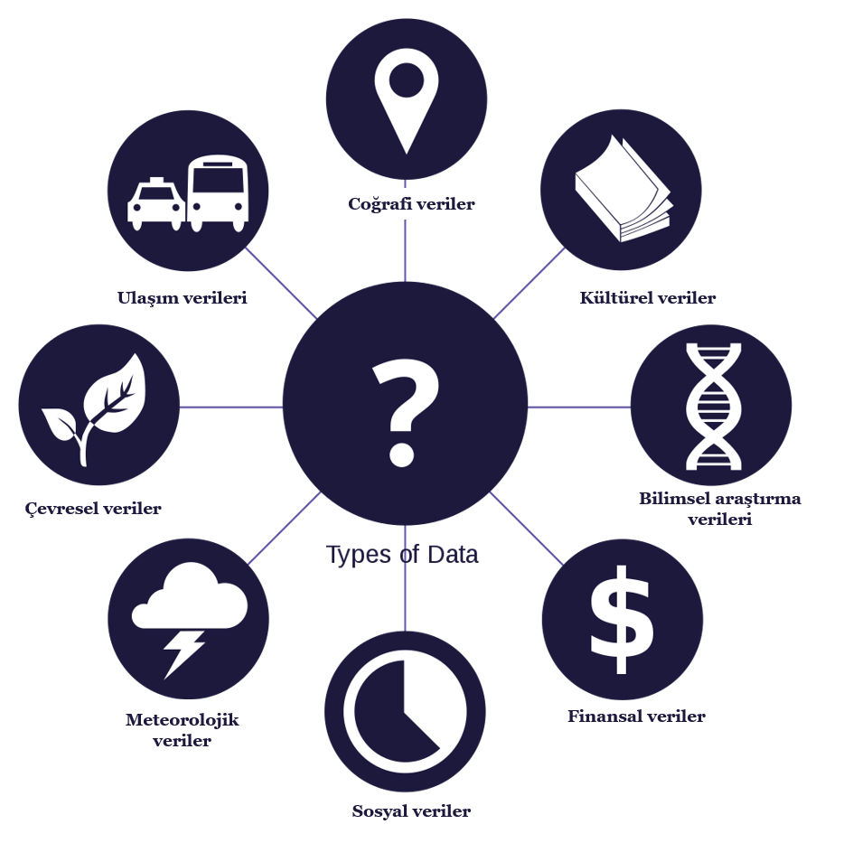

# 1.2.Açık Veri

Açık veri kavramı birçok çalışmada ve strateji belgelerinde farklı tanımlarla ifade edilmiştir. Açık devlet kavramı ve Açık veri kavramlarının yakın ilişkisi, açık verinin “kamu verilerinin kısıtlama olmaksızın erişime açılması” veya “herkes tarafından erişilebilen veri” şeklinde tanımlamaları da beraberinde getirmiştir. Ancak açık veri sadece devlet verilerini içermez. Açık veri, devletlerin, organizasyonların, araştırmacıların, vb. ücretsiz ve telif hakkı olmaksızın herkesin erişimine sunduğu veridir \(Sadiqa & Indulska, 2017\).

Açık veri; telif hakları, patent veya diğer kontrol mekanizmalarının kısıtlamaları olmaksızın, belirli bir verinin, herkes tarafından istedikleri gibi kullanma ve yayınlayabilmeleri için ücretsiz ulaşılabilir olması fikridir. İsteyen herkes tarafından ücretsiz olarak erişilebilen, tekrar kullanılabilen ve paylaşılabilen araştırma veya gözlem sonuçları açık veri olarak tanımlanmaktadır \(Gültekin, 2014\). Open Knowledge Foundation’ın tanımına göre eğer bir veri ya da içerik herkes tarafından ücretsiz bir şekilde erişebilirse, yeniden kullanabilirse ya da yeniden dağıtılabilirse açık olarak sayılabileceği belirtilmiştir \(Open Knowledge International, -\).

Açık veri özel ya da kamusal dijital verilerdir. Verilerin kaynağı özel organizasyonlar ya da kamu hizmetleridir. Bu veriler belirlenen yönteme göre anlamlı bir yapıda dağıtık halde tutulur ve herkesin  teknik, finansal, yasal bir sıkıntı olmadan kullanmasına olanak sağlayacak bir açık lisans sertifikasına sahiptir \(Monino & Sedkaoui, 2016\). Açık veri kavramı literatürde, birçok ülkenin eylem planında farklı tanımlarla yer almaktadır. Monino & Sedkaoui açık veri tanımını 3 kritik element üzerinden yapmıştır:

➡**Verinin mevcut ve erişilebilir olması:** verinin bütünlüğü bozulmamış şekilde varlığı ve veriye erişimin, veri üzerinde işlem yapmanın kolay bir biçimde sağlanması.

➡**Verinin tekrar kullanılailir ve dağıtılabilir olması**: verinin tekrar kullanılabilir, diğer veri setleriyle birleştirilebilir, yeni bir dağıtık işlemi uygulanabilir formatta olması.

➡**Evrensel Katılım:** verinin kullanılması ve paylaşımında kişi kısıtlaması olmaması.

Monino & Sedkaoui \(2016\)’e göre açık veriye kaynak sağlayabilecek özellikle üç alan söz konusudur:

➡ Bakanlıklar, belediyeler, meclis, özel ve üst kuruluşlar verdikleri hizmet ya da yaptıkları çalışmalar                      doğrultusunda üretilen önemli boyutta, anlamlı **kamu sektörü** verisi,

➡ Doğru teşvik ve lisanslama enstrümanları ile kamuya açık hale getirilebilecek **özel sektör** verisi,

➡ Özellikle kamu sektörü tarafından finanse edilen **bilimsel çalışmalar** süreçlerinde oluşan veri.

