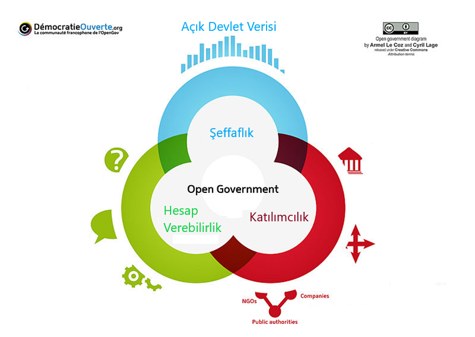

# 1.1. Açık Devlet

Açık Devlet, kamu yönetimindeki eylemlerin şeffaflığı, kamu hizmetlerine ve kamu bilgilerine erişebilirlik, devletin yeni fikirlere, ihtiyaçlara ve taleplere hızlı cevap verme yetkinliğini kapsar\(OECD, Modernising Government: The way forward. Paris: OECD Publishing, 2005\). Açık devlet, en temel düzeyde bir yurttaşın ülkesine ait işleyişe dair bilgi ve belgelere erişim hakkı kavramı\(World Bank, 2016\)  olmakla beraber şeffaflık, erişebilirlik ve işbirliği kavramları bir arada olması birçok açıdan kamusal ve toplumsal fayda sağlar: Usule dayalı politikalar geliştirme, birlikteliği güçlendirme, yolsuzlukla mücadele, yurttaşın devlete olan güveni gibi\(Ibid, 2009\).

Açık Devlet, kamu kaynaklarının araç olarak kullanılıp vatandaşların sorunların belirlenmesi ve çözülmesine dahil edilmesi sürecinin oluşturulması, karar mekanizmasının geliştirilmesi, güçlü politikalar belirlenmesi, yeni hizmet kanallarının teşvik edilmesi ile şeffaflığı arttırma gayesini barındıran adım ve girişimleri temsil eder \(Cersosimo, Origlia, & Bianchi, 2016\).

Açık Devlet, bünyesinde şeffaflığı, kamu katılımını ve iş birliğini destekleyen bir sistem olup bu sistemde vatandaşın kamu hizmetlerini geliştirmek amacıyla kamu verilerine erişebilmesi ve kullanmasına onay vardır.\(Bertot, McDermott, & Smith, 2012\).

Açık Devlet terimi 2000 yılı sonrası raporlarda, akademik yayınlarda ve ülkelerin politika belgelerinde ön plana çıkmaya başlamıştır. Altında yatan prensipler, girdiler ve hedeflenen çıktıları teker teker ele alındığında bu terimin kavramsal olarak çok da eski olmayacağı iddia edilebilir. Açık devlet kavramı bir çok ülke eylem raporlarında, akademik yayınlarda, ülke veya özel sektör platform raporlarında  farklı yaklaşımlarla, tanımlarla ve prensiplerle ifade edilmiş olup içeriklerin çerçevesinin oluşmasında ülkelerin tarihi, hukuki ve kültürel şekli etkili olmuştur. OECD açık devleti, “temelinde yenilikçi ve sürdürülebilir kamu politikaları üretilmesi ve uygulanması yatan yönetişim kültürü” şeklinde tanımlamış ve yine ilgili tanıma göre bu kavrama dair politikaların “şeffaflık, hesap verilebilirlik ve katılımcılık” prensiplerinde hareketle yaratılıp hayata geçirileceği yer almıştır\(OECD, 2016\). Ayrıca aynı raporda OECD ülkelerinin yüzde 49’u strateji belgelerinde net bir açık devlet  kavramı tanımı olmadığı belirtilmiştir.

Birçok farklı açık devlet tanımının olmasının en büyük sebeplerinden biri paydaşların ortak bir tanım üzerinde karar kılmamasıdır. Bu kapsamda bazı ülkelerin strateji belgelerinde açık devleti nasıl tanımladıklarının belirtilmesi ülkelerin genel olarak bu tanımı yaparken hangi yaklaşımı benimsediklerinin anlaşılması adına faydalı olacağı düşünülmüştür. Çeşitli politika belgelerinde açık devlet tanımına yönelik olarak, 

🇨🇦 Kanada; “Daha açık, hesap verilebilir ve katılımcı bir devlet süreci için vatandaşın erişim hakkını savunan bir yönetişim kültürüdür”, 

🇨🇱 Şili; “Halkla ilişkiler esaslarında ve kamu politikalarının tasarlanmasında, düzenlenmesinde, uygulanmasında ve geliştirilmesinde şeffaflık ve erişilebilirliğin temel alınarak idarenin kamu ilişkileri ve kurumsal çerçevenin güçlendirilmesi hedeflenen her kesime yönelik kamu politikasıdır”, 

🇫🇷 Fransa; “Açık devlet kamu harcamalarının şeffaflığı, vatandaş ve sivil toplumun farklı yapıdaki katılım ve işbirliklerine açıklıktır. Şeffaflık ve demokratik güvenin altyapısı açık veri, açık karar alma süreçleri ve hesap verilebilirlik ile sağlanır”, 

🇰🇷 Güney Kore; “Devlet 3.0 kamu verilerini açarak ve herkes ile paylaşarak özelleştirilmiş kamu hizmetlerini hayata geçirmek ve farklı alanlarda iş imkanlarına olanak sağlamak ile kamu kurumları arasındaki iletişimi ve işbirliğini artırmayı hedefleyen yeni bir paradigmadır. Devlet 3.0 devlet yönetimini daha hizmet odaklı, yetkin ve şeffaf yaparak vatandaşların refahını arttırmayı amaçlar”, 

🇲🇽 Meksika; “Açık devlet ve toplum arasındaki ilişkideki dönüşümü gözlemleyen yeni bir yönetişim modelidir. Bu model devleti inovasyon için platform olarak konumlandığı bir ortam yaratmaktadır”, 

🇳🇱 Hollanda; “Şeffaf, kolaylaştırıcı ve erişilebilir bir devlet” 

ifadelerine yer vermiştir \(Ubaldi, 2013\).

Birçok akademik çalışma açık devlet kavramı üç prensip üzerinden aktarmıştır: şeffaflık, hesap verebilirlik, katılımcılık \(Parycek & Sachs 2010, McDermott 2010, Saxena & Janssen 2017\). Obama Yönetimi de açık devlet kavramını bu üç prensip üzerinde ele alıp bir bildiri yayınlayarak açık devlet için yasal bir zemin kazandırmasından sonra diğer ülkeler de politika dokümanlarında açık devlet üzerine benzer esaslara yer vermiştir \(Gruen 2009, Britain 2009\). OECD \(2016\) raporunda  açık devlet; demokrasiye ve kapsayıcı büyümeye katkı sağlayan **şeffaflık**, **hesap verilebilirlik** ve **katılımcılık** prensiplerden destek alan yenilikçi ve sürdürülebilir kamu politikaları ve uygulamaları temelli yönetişim kültürü şeklinde tanımlanmıştır. Bu kapsamda; açık devlet kavramına yönelik detaylar bu üç prensip kapsamında ele alınacaktır.

