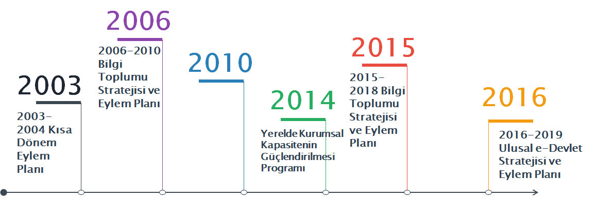

# 4.1.	Ulusal Politika Belgelerinde Açık Kavramı

Türkiye’deki açık devlet verisine bakış açısının ortaya konulması amacıyla ulusal politika belgelerinde yer alan eylem maddeleri bu başlık altında incelenecektir. Açık veri kavramının yanında, kamu verilerinin kamu kurumu dışındaki paydaşlarla paylaşımı, birey ve kurumların katılımını arttırmayı, kamu kurumlarının vatandaşlara karşı şeffaflığını arttırmayı amaçlayan eylem planları da ele alınacaktır. Bu kapsamda; 

* 2003-2004 Kısa Dönem Eylem Planı, 
* 2006-2010 Bilgi Toplumu Stratejisi ve Eylem Planı, 
* 2015-2018 Bilgi Toplumu Stratejisi ve Eylem Planı, 
* 2016-2019 Ulusal e-Devlet Stratejisi ve Eylem Planı, 
* Yerelde Kurumsal Kapasitenin Güçlendirilmesi Programı, 
* Saydamlığın Artırılması ve Yolsuzlukla Mücadelenin Güçlendirilmesi Stratejisi 

gibi politika dokümanları incelenecektir.

